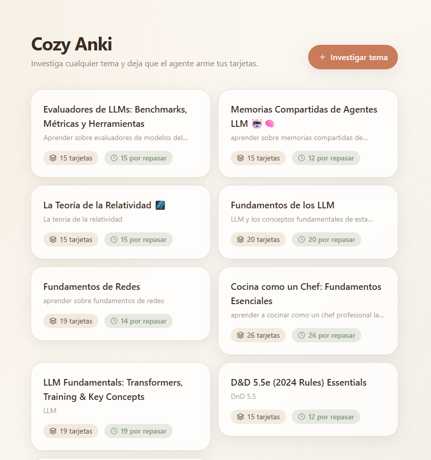
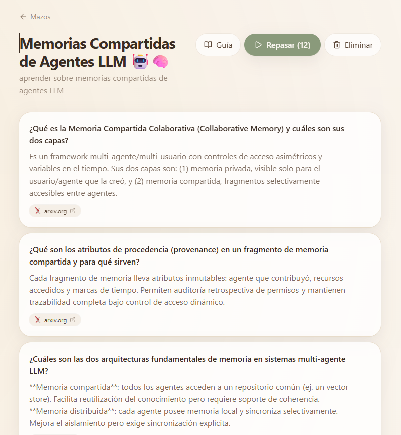
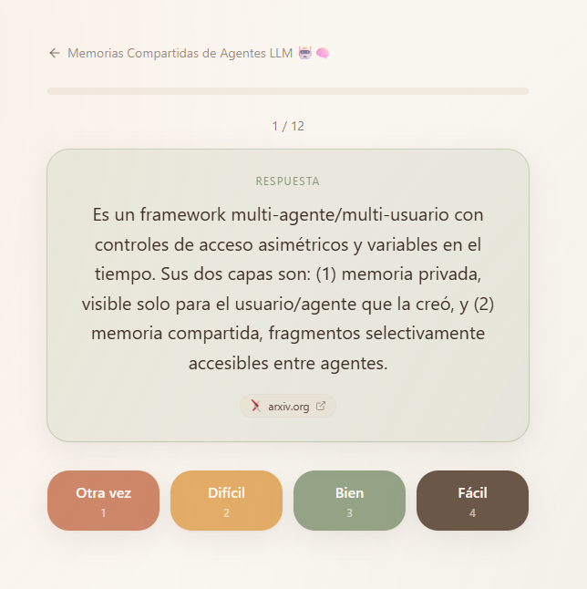

# Cozy Anki — AI Research Flashcard Agent

> **English** | [Español](#español)

An Anki-style flashcard app powered by an AI research agent. Give it a topic and it searches the web, generates verified flashcards, and writes a study guide — all automatically.

---

## Screenshots

| Home | Deck view |
|---|---|
|  |  |

| Flashcard — front | Flashcard — back |
|---|---|
|  |  |

---

## English

### What you need

- [Node.js](https://nodejs.org/) 18 or later
- An [Anthropic API key](https://console.anthropic.com/)

### Setup

**1. Clone and install dependencies**

```bash
git clone https://github.com/your-username/anki-agent.git
cd anki-agent
npm install
```

**2. Create your `.env` file**

```bash
cp .env.example .env
```

Open `.env` and paste your Anthropic API key:

```
ANTHROPIC_API_KEY=sk-ant-your-key-here
DATABASE_URL="file:./dev.db"
```

**3. Set up the database**

```bash
npm run db:generate
npm run db:push
```

This creates a local SQLite file (`prisma/dev.db`) — no external database needed.

**4. Start the app**

```bash
npm run dev
```

Open [http://localhost:3000](http://localhost:3000) in your browser.

### How to use it

1. Click **Research** and type any topic (e.g. "Quantum entanglement", "The French Revolution").
2. The agent searches the web, thinks, and generates flashcards in real time.
3. Once done, your deck appears on the home screen.
4. Click **Study** to review cards using the SM-2 spaced repetition algorithm.
5. Each deck also includes an auto-generated **study guide** in Markdown.

### Run tests

```bash
npm test
```

### Observability (cost & tracing)

Every model call is traced with OpenTelemetry (OpenLLMetry). Token cost is computed in
the OTel Collector, not in the app. To inspect runs locally:

```bash
cd otel && docker compose up -d   # Collector + Tempo + Prometheus + Grafana
```

Set `TRACELOOP_BASE_URL=http://localhost:4318` in `.env`, generate a deck, then open
Grafana at [http://localhost:3000](http://localhost:3000) to see per-run cost, p95 latency,
cache-hit rate, and the full `research_pipeline → research_turn_N → anthropic.chat` trace.
Details in [`otel/README.md`](otel/README.md).

### Tech stack

| Layer | Technology |
|---|---|
| Framework | Next.js 15 (App Router) |
| Language | TypeScript |
| Styling | Tailwind CSS + Framer Motion |
| AI Agent | Anthropic Claude (`claude-sonnet-4-6`) with native `web_search` |
| Database | SQLite via Prisma |
| Testing | Vitest |
| Observability | OpenTelemetry + OpenLLMetry → Tempo / Prometheus / Grafana |

---

## Español

### Qué necesitas

- [Node.js](https://nodejs.org/) 18 o superior
- Una [API key de Anthropic](https://console.anthropic.com/)

### Instalación

**1. Clona el repositorio e instala las dependencias**

```bash
git clone https://github.com/your-username/anki-agent.git
cd anki-agent
npm install
```

**2. Crea tu archivo `.env`**

```bash
cp .env.example .env
```

Abre `.env` y pega tu API key de Anthropic:

```
ANTHROPIC_API_KEY=sk-ant-tu-clave-aqui
DATABASE_URL="file:./dev.db"
```

**3. Configura la base de datos**

```bash
npm run db:generate
npm run db:push
```

Esto crea un archivo SQLite local (`prisma/dev.db`) — no necesitas ninguna base de datos externa.

**4. Inicia la aplicación**

```bash
npm run dev
```

Abre [http://localhost:3000](http://localhost:3000) en tu navegador.

### Cómo usarla

1. Haz clic en **Research** y escribe cualquier tema (ej. "Entrelazamiento cuántico", "La Revolución Francesa").
2. El agente busca en la web, razona y genera tarjetas de estudio en tiempo real.
3. Una vez terminado, tu mazo aparece en la pantalla principal.
4. Haz clic en **Study** para repasar las tarjetas con el algoritmo de repetición espaciada SM-2.
5. Cada mazo incluye también una **guía de estudio** generada automáticamente en Markdown.

### Correr los tests

```bash
npm test
```

### Observabilidad (costo y trazabilidad)

Cada llamada al modelo se traza con OpenTelemetry (OpenLLMetry). El costo en tokens se
calcula en el OTel Collector, no en la app. Para inspeccionar los runs en local:

```bash
cd otel && docker compose up -d   # Collector + Tempo + Prometheus + Grafana
```

Pon `TRACELOOP_BASE_URL=http://localhost:4318` en `.env`, genera un mazo y abre Grafana en
[http://localhost:3000](http://localhost:3000): verás costo por run, p95 de latencia,
cache-hit rate y la traza completa `research_pipeline → research_turn_N → anthropic.chat`.
Más detalles en [`otel/README.md`](otel/README.md).

### Stack tecnológico

| Capa | Tecnología |
|---|---|
| Framework | Next.js 15 (App Router) |
| Lenguaje | TypeScript |
| Estilos | Tailwind CSS + Framer Motion |
| Agente IA | Anthropic Claude (`claude-sonnet-4-6`) con `web_search` nativo |
| Base de datos | SQLite con Prisma |
| Tests | Vitest |
| Observabilidad | OpenTelemetry + OpenLLMetry → Tempo / Prometheus / Grafana |
